# 🧩 Summarise It — Chrome Extension with Spring Boot Backend

**Summarise It** is a lightweight Chrome extension that allows users to **summarize any selected text on a webpage** all powered by a **Spring Boot backend** that integrates with the **Gemini API**.

### 🧠 1. Summarise
- Select any portion of text on a webpage.  
- Click on the *Summarise It* icon.  
- Instantly receive a **concise, meaningful summary** powered by the Gemini API.

## 🏗️ Architecture Overview

```mermaid
flowchart TD

%% === FRONTEND ===
A[🧑‍💻 User selects text on webpage] --> B[🔹 Chrome Extension]

%% === BACKEND SUMMARIZATION ===
B --> C[📩 POST /api/summarise]
C --> D[☕ Spring Boot Backend]
D --> E[🧠 Preprocessing and Gemini API ]
E --> F[🧾 Summary Returned]
F --> G[🪟 Extension UI displays summary]

```

   

